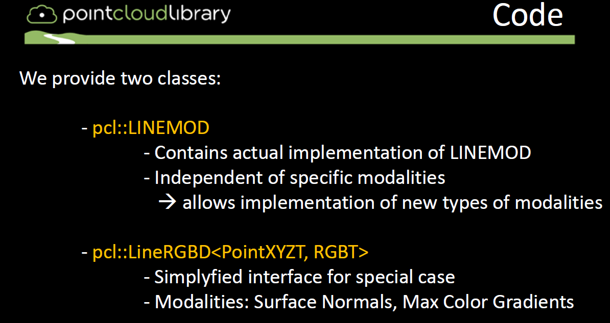

[个人博客](https://littlebearsama.github.io/2019/05/28/ObjectDetection-and-PoseEstimation/#more)
**物体检测与位姿估计**

针对刚性物体识别与位姿估计的方法主要分为三类：

- 基于模板匹配
- 基于三维局部特征
- 基于学习

<!--more-->

下面来细讲：

[资料整理](<https://github.com/littlebearsama/ObjectDetection>)

## 0.相关

1. 网站：[Detection and 6D Pose Estimation](<http://rkouskou.gitlab.io/research/6D_Object.html>)里面收录了很多文章和方法
2. 没趣啊知乎：[meiqua知乎](<https://zhuanlan.zhihu.com/p/35638736>)
3. 石头哥的目标检测(深度学习)笔记 [stone](<https://github.com/mensaochun/AwesomeDeepLearning/tree/master/ObjectDetection/summary>)

## 1.基于模板匹配(template matching)

基于模板匹配的6D目标位姿估计方法的研究始于20世纪90年代的单目图像。

**以不同视点下目标对象的整体外观作为模型模板**，

### A.2D

基于线条特征[^3]、边缘轮廓[^4]、冲击图形和曲线[^5]进行模型与输入的匹配。

可用的开源项目：

1. [shape_based_matching](<https://github.com/meiqua/shape_based_matching>)
2. [edge_based_matching](<https://sourceforge.net/p/vision-for-vs/svn/102/tree/branches/edge_based_matching/>)
3. [ShapeMatch](<https://github.com/dmccskylove/ShapeMatch>)
4. [LINE2D](<https://github.com/imbinwang/LINE2D>)
5. [OpenSSE](<https://github.com/zddhub/opensse>)

### B.2.5D

在增加了深度信息后，使得6D目标位姿估计对背景杂波具有更强的鲁棒性。针对机器人应用提出了快速、鲁棒的RGB-D特性，

如VFH[6]和CVFH[7]。stoisser等[8,9]提出了以图像梯度离散化方向和表面法线为特征的linemod方法。相似度得分在预先计算的响应图上快速计算出来，他们表明它比现有的方法在杂乱的背景下更健壮，也更快。

开源项目linemod(opencv和PCL中均有接口)：

1. [6DPose](<https://github.com/meiqua/6DPose>)
2. PCL提供两个类LINEMOD和lineRGBD

## 2.基于三维局部特征(3D local features)

在基于三维局部特征的方法中，六自由度位姿是根据**局部特征的对应关系**或**Hough投票中恢复**出来的。

早期提出了二维图像中提取的线条特征[^10]、边缘特征[^11]等多种局部特征。为了进行更稳健的估计，还提出了利用深度信息的局部描述符，如自旋图像[^12]和SHOT[^13]。

点对特性(PPF)[^14]是迄今为止最为成功和著名的三维局部描述符，并且已经提出了许多扩展版本。例如，选择边界或线[^15]点，计算分割点云[^16]上的PPF，改进点采样和投票[^17]。然而，与基于模板的方法相比，在6D位姿空间中进行模式搜索速度较慢。

（论文**BOP: Benchmark for 6D Object Pose Estimation** 中对15种方法进行了评估，得出结论是PPF表现最好，优于模板匹配方法（templates matching），基于学习（learning-based）的方法和基于3D local features的方法）

### 1.基于点云三维局部特征的方法3D local features

一般点云物体识别的流程是：

1. 提取关键点（keypoints）。比如iss关键点，sift关键点。它们的数据形式是三维向量XYZ+其他信息
2. 利用关键点keypoints作为种子计算特征描述子descriptors。比如3DSC描述子，LSP描述子。它们的数据形式是多维向量比如PFH的长度是125，SI的长度是225。
3. 匹配：实际上是通过特征描述子（descriptors）进行对应点（correspondence）估计。如SAC-IA算法。
4. 匹配后再通过一些点云的配准（registration）方法比如迭代最近点（ICP）进行精确配准。
5. 假设验证

使用PCL中的方法：

[3D_object_recognition_(pipeline)](<http://robotica.unileon.es/index.php/PCL/OpenNI_tutorial_5:_3D_object_recognition_(pipeline)>)

### 2.PPF vote-based pose estimation.（基于投票的位姿估计）

典型方法：PPF 

OPENCV和PCL中均有接口

hough transform霍夫变换

hough random forests霍夫随机森林

## 3.基于学习(learning-based)   

在基于学习的方法中，出现了很多利用**机器学习**技术提取识别特征，训练识别前景/背景、对象类和三维对象姿态的分类器。例如，学习模板匹配[^18]或投票[^19]的权重，学习潜在类分布[^20]和学习霍夫森林进行坐标回归[^21]。近年来，CNN被引入学习三维物体姿态[^22]的流形。提出了基于卷积自动编码器[^23]和自监督增强自动编码器[^24]的流形学习方法。Kehl等人提出了类似ssd的CNN架构，用于估计对象的二维位置、类和三维位姿。利用基于CNN的检测器检测三维控制点或包围盒角的投影二维点，而不是估计三维位姿类[^25,26,27]。虽然最近的基于CNN的方法与其他两种方法相比，对背景杂波和局部遮挡的鲁棒性更高，但是它们的训练需要大量的带注释的训练样本，并且在GPU上花费更长的时间。

### **1.3D-Machine-Learning**

[3D-Machine-Learning](<https://github.com/timzhang642/3D-Machine-Learning>)

- [Datasets](https://github.com/timzhang642/3D-Machine-Learning#datasets)
- [3D Pose Estimation](https://github.com/timzhang642/3D-Machine-Learning#pose_estimation)
- [Courses](https://github.com/timzhang642/3D-Machine-Learning#courses)
- [Single Object Classification](https://github.com/timzhang642/3D-Machine-Learning#single_classification)
- [Multiple Objects Detection](https://github.com/timzhang642/3D-Machine-Learning#multiple_detection)
- [Scene/Object Semantic Segmentation](https://github.com/timzhang642/3D-Machine-Learning#segmentation)
- [3D Geometry Synthesis/Reconstruction](https://github.com/timzhang642/3D-Machine-Learning#3d_synthesis)
- [Texture/Material Analysis and Synthesis](https://github.com/timzhang642/3D-Machine-Learning#material_synthesis)
- [Style Learning and Transfer](https://github.com/timzhang642/3D-Machine-Learning#style_transfer)
- [Scene Synthesis/Reconstruction](https://github.com/timzhang642/3D-Machine-Learning#scene_synthesis)
- [Scene Understanding](https://github.com/timzhang642/3D-Machine-Learning#scene_understanding)

### 2.A Tutorial on 3D Deep Learning

[A Tutorial on 3D Deep Learning](<http://3ddl.stanford.edu/>)

### 3.3D Convolutional Neural Networks — A Reading List

[3D Convolutional Neural Networks — A Reading List](

